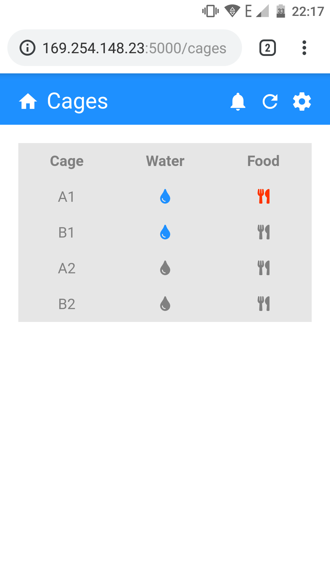
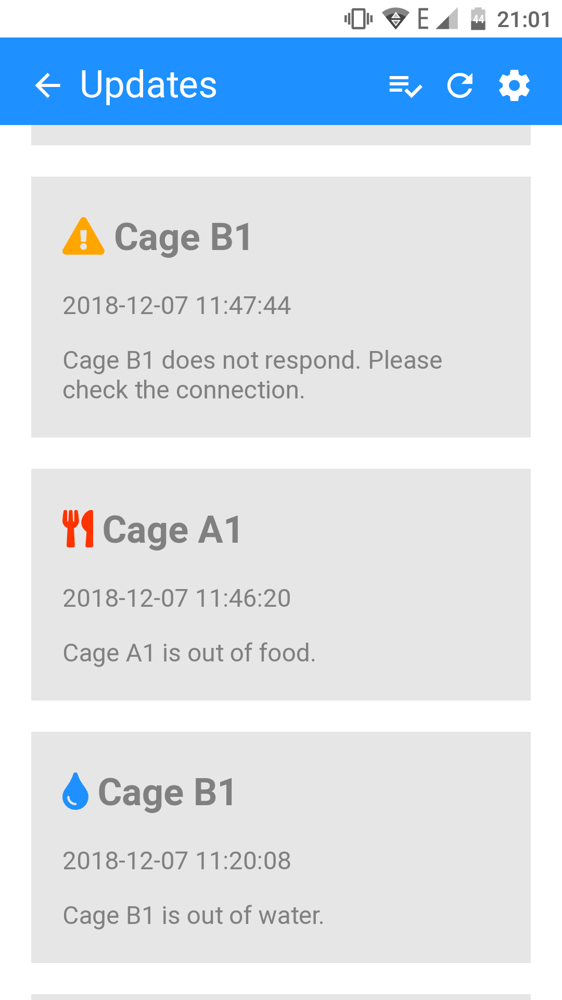
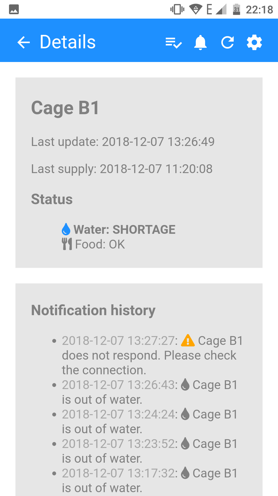
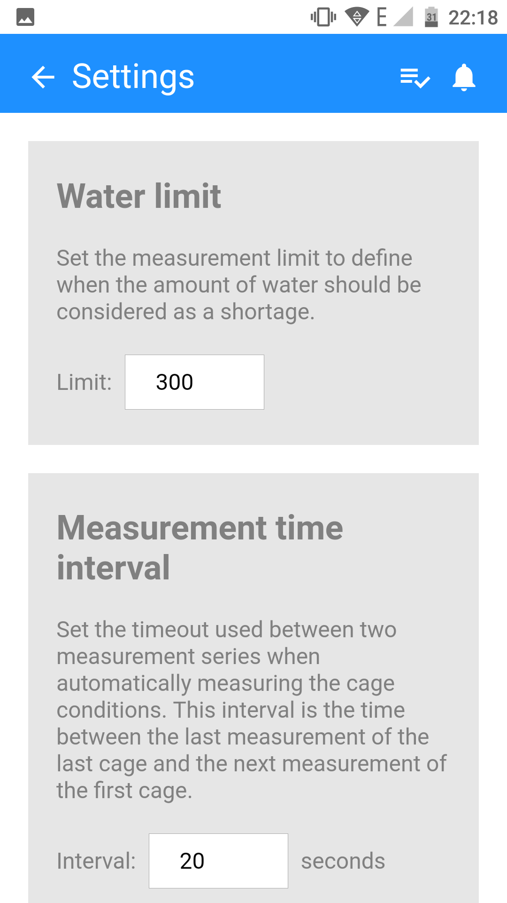

# IVC-Monitoring
The code of an IVC cage monitoring project using Arduino and Raspberry Pi.
The code in this repository was taken from a team project to which I participated and for which
I build a Python Flask web app running on an Raspberry Pi and some program
that ran on Arduino Nano, controlling sensors to estimate the food and water levels
of the cage.

**Note that not everything in this repository is documented well, if anything at all.**

Some screenshots of the web app:

  
  
  
  

